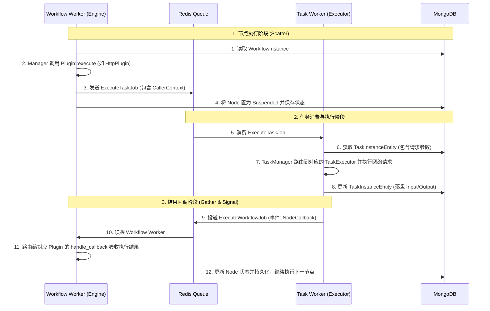
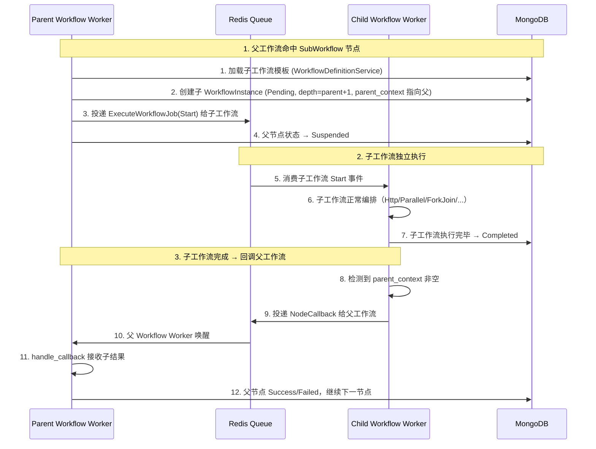

# 分布式工作流引擎架构设计文档

本文档详细描述了本工作流引擎的架构设计、插件化系统、以及调度器与执行器之间的交互流转模型。

## 1. 核心架构设计

引擎采用了 **编排器 (Orchestrator)** 与 **执行器 (Executor)** 分离的微服务架构。通过分布式的消息队列（当前为 Apalis + Redis），将系统拆分为两类独立运行的 Worker 节点。

### 1.1 Worker 角色划分

1. **Workflow Worker (编排器)**
   * **职责**：负责工作流有向图的拓扑迭代、状态机流转、执行上下文（Context）的维护与传递、插件控制流的决策。
   * **行为**：它本身**不执行**任何诸如 HTTP 请求或脚本解析等重量级耗时操作。当执行到一个动作节点（如 HTTP 请求）时，它只负责生成一张任务执行工单，丢给队列，然后就挂起休眠，释放计算资源。

2. **Task Worker (执行器)**
   * **职责**：负责干脏活累活。从任务队列中抓取任务，调用具体的 `TaskExecutor`（如 `HttpTaskExecutor`）发起实际的网络请求、执行脚本等。
   * **行为**：执行完成后，负责将结果（Output、Error等）打包成事件（Event），反向投递给工作流队列，通知对应的 Workflow Worker 醒来收工。

### 1.2 架构交互图



---

## 2. 插件化系统 (Plugin System)

为了让系统拥有极强的扩展能力，我们将任务的抽象剥离成了两层接口：**编排插件接口 (`PluginInterface`)** 与 **执行器接口 (`TaskExecutor`)**。

### 2.1 编排插件 (`PluginInterface`)

该接口存在于 Workflow Worker 的上下文中。**它是工作流的路由大脑，而非干活的苦力。**
主要用于实现：如何发射子任务、遇到子任务回调时如何合并状态、如何进行分支跳转（如 If 条件）等控制流逻辑。

```rust
#[async_trait]
pub trait PluginInterface: Send + Sync {
    // 【前置逻辑】当工作流运行到该节点时触发。
    // 一般用于：解析配置、生成并向下分发 ExecuteTaskJob、或者针对控制流节点(IfCondition)直接返回跳到哪。
    async fn execute(...) -> anyhow::Result<ExecutionResult>;

    // 【后置回调逻辑】当远端的 Task Worker 汇报“任务已完成”时触发。
    // 一般用于：普通节点直接拷贝结果并完结；并发节点(Parallel)做数据聚合和增量派发。
    async fn handle_callback(...) -> anyhow::Result<ExecutionResult>;
    
    fn plugin_type(&self) -> TaskType;
}
```

**代表实现**：
* `HttpPlugin`：`execute` 里构造一条任务工单推到队列，直接返回 `Pending` 挂起。`handle_callback` 里直接接收结果，返回 `Success`。
* `IfConditionPlugin`：不需要队列交互。`execute` 里直接运行表达式库，算出来 `true` 还是 `false`，当即返回 `Success(JumpTo(TargetNode))` 告知工作流下一跳转去哪里。
* `ParallelPlugin`：并发大杀器，接下来详述。

### 2.2 任务执行器 (`TaskExecutor`)

该接口存在于 Task Worker 的上下文中。它的职责极其单一：拿到一段静态的输入参数，把它跑完，返回一段静态的输出结果。

```rust
#[async_trait]
pub trait TaskExecutor: Send + Sync {
    async fn execute_task(&self, task_instance: &TaskInstanceEntity) -> anyhow::Result<TaskExecutionResult>;
    fn task_type(&self) -> TaskType;
}
```

---

## 3. 并发容器 (Parallel Plugin) 深度剖析

`Parallel` 并不是一个普通的“执行某段代码”的节点，它是一个 **Scatter-Gather (分散-聚合)** 模式的微型调度器本身。
由于它可能需要遍历处理 10 万条数据的数组，因此**坚决不能**在一次 `execute` 里把 10 万条队列任务全部发出，这会瞬间造成内存 OOM 和 Redis 拥堵。

因此，Parallel 借助了我们的 `NodeCallback` 内部事件机制，实现了一个非常精妙的状态机。

### 3.1 状态机存储

Parallel 借用了它自身的 `TaskInstanceEntity.output` 来充当状态机的内存条，并利用 MongoDB 作为持久化存储（即便引擎宕机重启，进度也能从 DB 恢复）。
```json
{
  "total_items": 1000,
  "dispatched_count": 10,
  "success_count": 0,
  "failed_count": 0
}
```

### 3.2 增量控制流 (Scatter & Gather)

1. **首次执行 (Scatter 播种)**
   在 `ParallelPlugin::execute` 中，只解析目标数组大小（如 1000）。并且**仅仅**根据设定的 `concurrency` 阈值（如 10），生成**前 10 个** `ExecuteTaskJob` 扔进任务队列，并记录 `dispatched_count = 10`。
   > **关键点**：这发出去的 10 个 Job 中，它的 `caller_context` 里携带了 `parent_task_instance_id` (指向这个 Parallel 的 ID)，以及自己代表的是数组里的第 `item_index` 个元素。

2. **异步回调与增量补货 (Gather 收获)**
   随着 Task Worker 并发执行这 10 个任务，会有捷足先登者完成并向 Workflow Worker 发射 `NodeCallback` 事件。
   事件流转进入 `ParallelPlugin::handle_callback`，在此进行如下决断：
   
   * **状态聚合**：根据子任务的成败，对 `success_count` 或 `failed_count` 进行加一。
   * **失败熔断**：检测 `failed_count > max_failures`。若超过容忍度，整个 Parallel 立即短路失败，抛弃未执行的任务。
   * **完成检测**：若 `success_count + failed_count == total_items`，全员收工，向引擎返回 `Success` 推动主流程前行。
   * **并发补货**：如果既未熔断也未完成，则根据并发模式开始派发新任务：
     * **Rolling (滚动模式)**：犹如滑动窗口，走了一个补一个，立即派发第 `dispatched_count` 号任务给队列，保证全速满负荷运转。
     * **Batch (批量模式)**：按兵不动，直到前 10 个任务全部死活出结果了，才一次性把后 10 个任务发出。

通过这种“任务唤醒自己”的设计（Event-Driven Callback），系统不仅做到了完美解耦，而且拥有了抵抗海量数据冲击的弹性能力。

---

## 4. 分布式锁与数据一致性 (CAS)

在分布式环境中，同一个工作流实例可能因为并发的回调（如 Parallel 节点的多个子任务同时完成）被多个 Workflow Worker 同时唤醒。为了防止“更新丢失（Lost Update）”和“数据撕裂”，引擎在 `WorkflowInstanceEntity` 中设计了乐观锁与租约机制：

```rust
pub struct WorkflowInstanceEntity {
    // ...
    pub epoch: u64, // 乐观锁版本号
    pub locked_by: Option<String>, // 当前持有该工作流锁的 Worker ID
    pub locked_duration: Option<std::time::Duration>, // 锁的过期时间（租约）
}
```

### 4.1 字段设计与租约 (Lease) 机制

* **`epoch` (乐观锁版本号)**：每次对 `WorkflowInstanceEntity` 的成功修改并持久化到 MongoDB 时，`epoch` 都会原子性加 1。任何 Worker 在更新时都必须携带自己读取到的 `epoch` 进行 CAS（Compare-And-Swap）操作。若数据库中实际 `epoch` 不匹配，说明数据已被其他 Worker 修改，当前更新操作被拒绝并触发重试。
* **`locked_by` 和 `locked_duration` (悲观租约)**：为了防止多个 Workflow Worker 频繁争抢同一个工作流实例导致的 CAS 冲突风暴（尤其在 Parallel 密集回调时），引擎引入了“租约”概念。当一个 Worker 认领了工作流事件，它会设置 `locked_by = "self_worker_id"` 并给予一定的锁定时长（如 10 秒）。
  * 在租约期间内，其他 Worker 哪怕收到了唤醒该工作流的事件，也需要让步或等待。
  * 如果持有锁的 Worker 崩溃宕机，租约（`locked_duration`）到期后，“扫地僧”机制或其他 Worker 即可重新抢占该实例，保证不会产生永远卡死在 Running 状态的孤儿任务。

### 4.2 并发容器 (Parallel) 回调的 CAS 演进过程

在 Parallel 节点运行中，假设有 100 个 HTTP 子任务被并发扔到 Task Worker 执行。随着任务快速完成，它们会密集地向 Workflow Worker 推送 `NodeCallback` 唤醒事件。

在这个场景下，数据的流转与 `epoch` 的变化如下：

1. **并发唤醒冲突**：子任务 A 和子任务 B 几乎同时完成，向队列中推入了两个 `NodeCallback` 事件。
2. **锁争抢阶段**：
   * Worker 1 消费到 A 的事件，Worker 2 消费到 B 的事件。
   * 它们同时去 MongoDB 读取 `WorkflowInstance`（当前 `epoch = 5`，无锁）。
   * Worker 1 和 Worker 2 尝试通过 CAS (条件 `epoch == 5` 且未被锁定) 抢占这把锁并更新。
   * MongoDB 的原子性保证了只有一个能赢，假设 Worker 1 赢了，此时 MongoDB 里 `locked_by = "Worker-1"`, `epoch` 变为 `6`。
3. **退让与事件不丢失 (Retry机制)**：
   * Worker 2 更新失败（受制于 CAS 检查 `epoch == 5` 失败，或发现被锁定），它会抛出 `OptimisticLockError` 或者 `LeaseLockedError`。
   * **如何确保事件不丢失**：因为底层的任务队列（Apalis/Redis）支持 **ACK/NACK 机制**。Worker 2 在处理该 `NodeCallback` 事件时一旦遇到数据库层面的乐观锁失败报错，它**不会向队列发送 ACK**。相反，它会向队列发送一个 NACK（或者让事件超时），这导致该 `NodeCallback` 事件会重新回到队列中（或进入重试死信队列），并在短暂的延迟后被 Worker 2 或其他 Worker 重新消费。
4. **安全处理状态**：
   * Worker 1 在租约保护下，安全地进入 `ParallelPlugin::handle_callback`，将状态机中的 `success_count` +1。
   * 处理完毕后，Worker 1 执行 Save 释放锁，此时 CAS 更新条件为 `epoch == 6`，更新成功后释放 `locked_by`，`epoch` 变为 `7`。
5. **后续唤醒**：
   * Worker 2 的重试机制再次触发，重新从 MongoDB 加载最新的状态（此时 `epoch = 7`，`success_count` 已经被加过 1 了）。
   * Worker 2 抢占成功（`epoch` 变 8），处理子任务 B 的回调，再次把 `success_count` +1，完成后释放，`epoch` 变 9。

**结论**：在密集回调的 Gather 阶段，虽然大量的子任务完成事件如洪水般涌向 Workflow Worker，但依靠 `epoch` (CAS乐观锁) 保证了 `success_count` 等共享数据绝对不会被并发覆盖；同时依靠 `locked_by` (租约) 减缓了冲突摩擦，保障了系统在极致并发下的数据强一致性。

---

## 5. 异构并发容器 (ForkJoin Plugin) 深度剖析

### 5.1 Parallel vs ForkJoin

| 维度 | Parallel (同构并发/数据并行) | ForkJoin (异构并发/任务并行) |
|------|------|------|
| 数据源 | 一个 JSON 数组 × 同一个任务模板 | N 个**不同的** TaskTemplate |
| 子任务类型 | 全部相同（如全是 HTTP） | 可以不同（HTTP + gRPC + ...） |
| 典型场景 | "给 1000 个用户各发一封邮件" | "同时拉用户数据 + 发通知 + 生成报告" |
| 并发控制 | concurrency + Rolling/Batch | 同样 concurrency + Rolling/Batch |
| 失败控制 | max_failures | 同样 max_failures |

二者本质上共享同一套 Scatter-Gather + Callback 状态机，区别仅在于数据源：Parallel 从数组动态展开 N 个相同任务，ForkJoin 从静态列表展开 N 个不同任务。

### 5.2 模板定义

```rust
pub struct ForkJoinTemplate {
    pub tasks: Vec<ForkJoinTaskItem>,   // 子任务列表
    pub concurrency: u32,               // 并发度
    pub mode: ParallelMode,             // Rolling / Batch
    pub max_failures: Option<u32>,      // 最大失败容忍数
}

pub struct ForkJoinTaskItem {
    pub task_key: String,               // 容器内唯一标识
    pub name: String,                   // 可读名称
    pub task_template: TaskTemplate,    // 任意原子任务模板 (Http, gRPC, ...)
}
```

### 5.3 子任务类型约束

由于引擎采用 Workflow Worker (编排) / Task Worker (执行) 双角色分离架构，容器类插件 (`Parallel`, `ForkJoin`) 和控制流插件 (`IfCondition`) 仅有 `PluginInterface` 实现（编排侧），没有 `TaskExecutor` 实现（执行侧）。

因此：**容器的子任务只能是拥有 `TaskExecutor` 的原子任务类型**（Http, gRPC, Approval 等）。

```
ForkJoin.execute()
  → 派发子任务 ExecuteTaskJob(template=Parallel)
  → Task Worker 消费
  → TaskManager 找不到 Parallel 的 TaskExecutor ❌
```

如需嵌套容器逻辑，正确的做法是将内层容器建模为一个**子工作流**，由 Workflow Worker 独立编排。

### 5.4 状态机存储

与 Parallel 一样借用 `TaskInstanceEntity.output`，但额外包含 `results` Map 用于按 `task_key` 索引每个子任务的执行结果：

```json
{
  "total_tasks": 3,
  "dispatched_count": 3,
  "success_count": 1,
  "failed_count": 0,
  "results": {
    "fetch_user": { "status": "Success", "output": { ... } },
    "send_email": { "status": "Failed", "error": "timeout" },
    "notify_slack": null
  }
}
```

后续节点可通过 `task_key` 精确引用某个子任务的输出结果。

### 5.5 Scatter & Gather 流程

**Scatter (execute)**：读取 `tasks` 列表 → 初始化状态机 → 按 `concurrency` 派发前 N 个子任务 → `caller_context.item_index` 记录子任务在列表中的索引。

**Gather (handle_callback)**：与 Parallel 共享完全相同的决策逻辑（状态聚合 → 失败熔断 → 完成检测 → 并发补货），唯一区别是额外将结果写入 `results[task_key]`。

---

## 6. 子工作流嵌套 (SubWorkflow Plugin)

工作流之间没有高低之分，任何工作流都可以作为另一个工作流中的一个节点被调用。SubWorkflow 节点本质上与 Http、Parallel 处于同一层次——都是工作流图中的一个节点。区别仅在于：Http 投递任务给 Task Worker，而 SubWorkflow 投递的是**一个全新的工作流实例**给 Workflow Worker。

### 6.1 模板定义

```rust
pub struct SubWorkflowTemplate {
    pub workflow_meta_id: String,         // 引用哪个工作流
    pub workflow_version: u32,            // 指定版本
    pub input_mapping: Option<JsonValue>, // 传递给子工作流的上下文
    pub output_path: Option<String>,      // 子工作流结果写回父节点上下文的路径
    pub timeout: Option<u64>,             // 超时（秒）
}
```

### 6.2 实体扩展

`WorkflowInstanceEntity` 新增两个字段：

```rust
pub struct WorkflowInstanceEntity {
    // ... 原有字段 ...
    pub parent_context: Option<WorkflowCallerContext>, // 若自己是子工作流，记录父工作流信息
    pub depth: u32,                                    // 嵌套深度，根工作流=0
}
```

### 6.3 执行时序



### 6.4 父回调机制

子工作流到达终态（Completed / Failed）后，`PluginManager::process_workflow_job` 在释放锁之前检查 `parent_context`：

* 若 `parent_context` 非空 → 向父工作流投递 `NodeCallback` 事件（携带子工作流的上下文作为 output）
* 若为空 → 根工作流，正常结束

这与 Task Worker 完成后回调父工作流的机制**完全一致**，复用了同一套 `NodeCallback` 事件通道。

### 6.5 防循环递归

| 策略 | 说明 |
|------|------|
| 深度限制 | `depth` 字段每嵌套一层 +1，超过 `MAX_DEPTH`（默认 10）直接拒绝 |

子工作流的 `handle_callback` 直接使用 `PluginInterface` trait 的默认实现——子工作流的完成状态和输出直接映射为父节点的状态。

---

## 7. 多租户系统 (Multi-Tenancy)

### 7.1 设计总则

系统从数据模型层面原生支持多租户，所有工作流和原子任务均携带 `tenant_id`。租户隔离的**唯一门禁**在 API Server 侧，执行引擎（Worker）对租户完全无感知，只按 Job 维度执行。

```
请求 → [AuthMiddleware] → [TenantGuard] → [PermissionGuard] → Handler
         ↓                    ↓                 ↓
    验证 JWT Token       校验租户状态         检查角色权限
    解析 AuthContext      注入 tenant_id      匹配路由所需权限
```

### 7.2 核心实体

**租户表 (TenantEntity)**

| 字段 | 类型 | 说明 |
|------|------|------|
| tenant_id | String | 主键 |
| name | String | 租户名称 |
| description | String | 描述 |
| status | TenantStatus | Active / Suspended / Deleted |
| max_workflows | Option\<u32\> | 配额：最大工作流模板数 |
| max_instances | Option\<u32\> | 配额：最大运行实例数 |

**用户表 (UserEntity)**

| 字段 | 类型 | 说明 |
|------|------|------|
| user_id | String | 主键 |
| username | String | 唯一 |
| email | String | 唯一 |
| password_hash | String | bcrypt 哈希 |
| is_super_admin | bool | 系统级超管标记 |
| status | UserStatus | Active / Disabled |

**用户-租户角色关联表 (UserTenantRole)**

| 字段 | 类型 | 说明 |
|------|------|------|
| user_id | String | 外键 |
| tenant_id | String | 外键 |
| role | TenantRole | TenantAdmin / Developer / Operator / Viewer |

### 7.3 角色与权限矩阵

| 权限域 | SuperAdmin | TenantAdmin | Developer | Operator | Viewer |
|--------|:---:|:---:|:---:|:---:|:---:|
| 租户管理（创建/暂停/删除） | ✅ | ❌ | ❌ | ❌ | ❌ |
| 跨租户访问 | ✅ | ❌ | ❌ | ❌ | ❌ |
| 租户内用户管理 | ✅ | ✅ | ❌ | ❌ | ❌ |
| 工作流/任务模板 CRUD | ✅ | ✅ | ✅ | ❌ | ❌ |
| 实例 创建/执行/取消/重试 | ✅ | ✅ | ✅ | ✅ | ❌ |
| 只读查看 | ✅ | ✅ | ✅ | ✅ | ✅ |

### 7.4 JWT Token 设计

```json
{
  "sub": "user_id",
  "username": "alice",
  "is_super_admin": false,
  "tenant_id": "tenant_001",
  "role": "Developer",
  "exp": 1700000000
}
```

SuperAdmin 可通过 `X-Tenant-Id` Header 代入任意租户上下文。

### 7.5 数据隔离

所有 Repository 查询自动携带 `tenant_id` 过滤条件。Handler 从 `AuthContext` 获取 `tenant_id` 传递给 Service/Repository 层，确保数据不会跨租户泄漏。

### 7.6 API 路由

```
/api/v1/auth             ← 公开（无需 JWT）
  POST /login
  POST /register

/api/v1/tenants          ← SuperAdmin 专属
  CRUD

/api/v1/tenants/users    ← TenantAdmin+
  邀请/移除/改角色

/api/v1/workflow         ← 以下全部 tenant_id 自动隔离
/api/v1/task
```

---

## 8. 变量系统 (Variable System)

### 8.1 设计总则

变量系统为工作流引擎提供了统一的外部配置注入能力。用户可以在不修改工作流模板的前提下，通过变量来改变运行时行为（如切换 API 地址、注入凭证等）。变量按作用域分层，越靠近执行现场的变量优先级越高。

### 8.2 变量层级与优先级

| 优先级 | 层级 | scope_id | 说明 | 来源 |
|:------:|------|----------|------|------|
| 1 (最低) | **租户变量** | `tenant_id` | 全租户共享的基础配置 | `VariableEntity (scope=Tenant)` |
| 2 | **工作流模板变量** | `workflow_meta_id` | 某个工作流的默认配置 | `VariableEntity (scope=WorkflowMeta)` |
| 3 | **工作流实例变量** | `workflow_instance_id` | 运行时传入的上下文 | `WorkflowInstanceEntity.context` |
| 4 (最高) | **节点上下文** | `node_id` | 单节点的局部覆盖 | `WorkflowNodeInstanceEntity.context` |

> 优先级 3、4 已存在于现有实体的 `context` 字段中，无需额外建模。变量系统仅为优先级 1、2 新增持久化实体。

### 8.3 变量实体

```rust
pub enum VariableScope {
    Tenant,        // 租户级
    WorkflowMeta,  // 工作流模板级
}

pub enum VariableType {
    String,
    Number,
    Bool,
    Json,
    Secret,  // 加密存储，API 掩码返回
}

pub struct VariableEntity {
    pub id: String,
    pub tenant_id: String,
    pub scope: VariableScope,
    pub scope_id: String,          // tenant_id 或 workflow_meta_id
    pub key: String,               // 变量名，scope_id + key 唯一
    pub value: String,             // 存储值（Secret 类型 AES-256-GCM 加密）
    pub variable_type: VariableType,
    pub description: Option<String>,
    pub created_by: String,        // user_id
    pub created_at: DateTime<Utc>,
    pub updated_at: DateTime<Utc>,
}
```

### 8.4 变量类型与安全策略

| 类型 | 存储方式 | API 响应 | 引擎解析 |
|------|----------|----------|----------|
| `String` | 明文 | 明文 | 原样注入 |
| `Number` | 明文 | 明文 | 解析为 `f64` |
| `Bool` | 明文 | 明文 | 解析为 `bool` |
| `Json` | 明文 JSON | 明文 | 解析为 `serde_json::Value` |
| `Secret` | **AES-256-GCM 加密** | `"******"` 掩码 | **运行时解密注入，不落盘到 output** |

加密密钥来源于环境变量 `VARIABLE_ENCRYPT_KEY`，缺失时拒绝启动。

### 8.5 变量解析流程

引擎在执行每个节点前，由 `VariableService::resolve_variables` 构造合并后的变量上下文：

```
resolve_variables(tenant_id, workflow_meta_id, instance_context, node_context):
    merged = {}
    merged.extend(load_tenant_variables(tenant_id))          // 优先级 1
    merged.extend(load_workflow_meta_variables(meta_id))      // 优先级 2 覆盖 1
    merged.extend(instance_context)                           // 优先级 3 覆盖 2
    merged.extend(node_context)                               // 优先级 4 覆盖 3
    return merged
```

Rhai 表达式（IfCondition）和模板渲染（HTTP URL/Body）均基于此 `merged` 上下文执行。Secret 类型的变量在解析阶段解密注入，但**绝不写入** `TaskInstanceEntity.output`，防止凭证泄漏到持久化层。

### 8.6 权限矩阵

| 操作 | SuperAdmin | TenantAdmin | Developer | Operator | Viewer |
|------|:---:|:---:|:---:|:---:|:---:|
| 租户变量 CRUD | ✅ | ✅ | 仅读（Secret 掩码） | 仅读（Secret 掩码） | 仅读（Secret 掩码） |
| 租户 Secret 变量 创建/改值 | ✅ | ✅ | ❌ | ❌ | ❌ |
| 模板变量 CRUD | ✅ | ✅ | ✅ | 仅读 | 仅读 |
| 模板 Secret 变量 创建/改值 | ✅ | ✅ | ✅ | ❌ | ❌ |

### 8.7 API 路由

```
# 租户变量
GET    /api/v1/variables                                    # 列表
POST   /api/v1/variables                                    # 创建
GET    /api/v1/variables/{id}                               # 详情（Secret 掩码）
PUT    /api/v1/variables/{id}                               # 更新
DELETE /api/v1/variables/{id}                               # 删除

# 工作流模板变量
GET    /api/v1/workflow/meta/{meta_id}/variables             # 列表
POST   /api/v1/workflow/meta/{meta_id}/variables             # 创建
GET    /api/v1/workflow/meta/{meta_id}/variables/{id}        # 详情
PUT    /api/v1/workflow/meta/{meta_id}/variables/{id}        # 更新
DELETE /api/v1/workflow/meta/{meta_id}/variables/{id}        # 删除
```

### 8.8 涉及代码变更

| 层级 | 变更 |
|------|------|
| `domain/variable/entity` | 新增 `VariableEntity`、`VariableScope`、`VariableType` |
| `domain/variable/repository` | `VariableRepository` trait |
| `domain/variable/service` | `VariableService`（CRUD + AES 加解密 + `resolve_variables`） |
| `infrastructure/mongodb/variable` | MongoDB 实现 |
| `api/handler/variable` | Handler + 权限守卫 |
| `api/router` | 路由挂载 |
| `domain/plugin/manager` | 执行节点前调用 `resolve_variables` 合并上下文 |

---

## 9. 总结与扩展

当前基于 **PluginFactory -> Queue -> Executor -> Callback Event -> Plugin.handle_callback** 的大闭环，使得这个 Rust 工作流引擎从玩具级别跃升至了企业级微服务架构。

未来的扩展方案：
1. **人工审批节点**：写一个 `ApprovalPlugin`，它连 Task Worker 都不需要找，`execute` 返回 `Pending` 后，直接等待外部 API 接口推入一个包含审批结果的 `NodeCallback` 事件到 Workflow 队列，就能顺滑将其唤醒。
2. **延迟节点**：通过向 Apalis 推送定时消息，延时触发。
3. **上下文重写插件**：基于 Rhai 脚本引擎，在节点之间插入一个纯计算节点，对工作流上下文做任意变换（字段提取、类型转换、数据聚合等），结果写回上下文供后续节点使用。