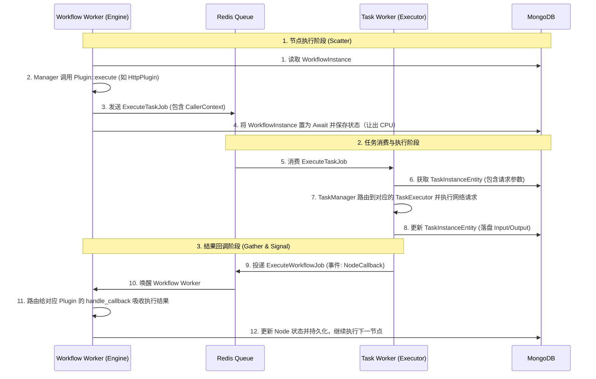
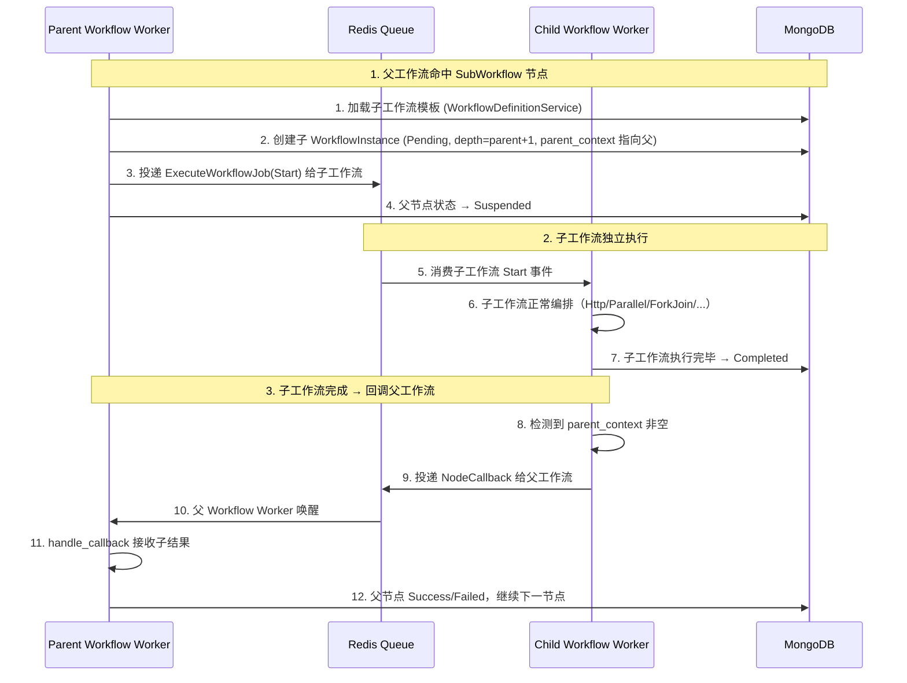
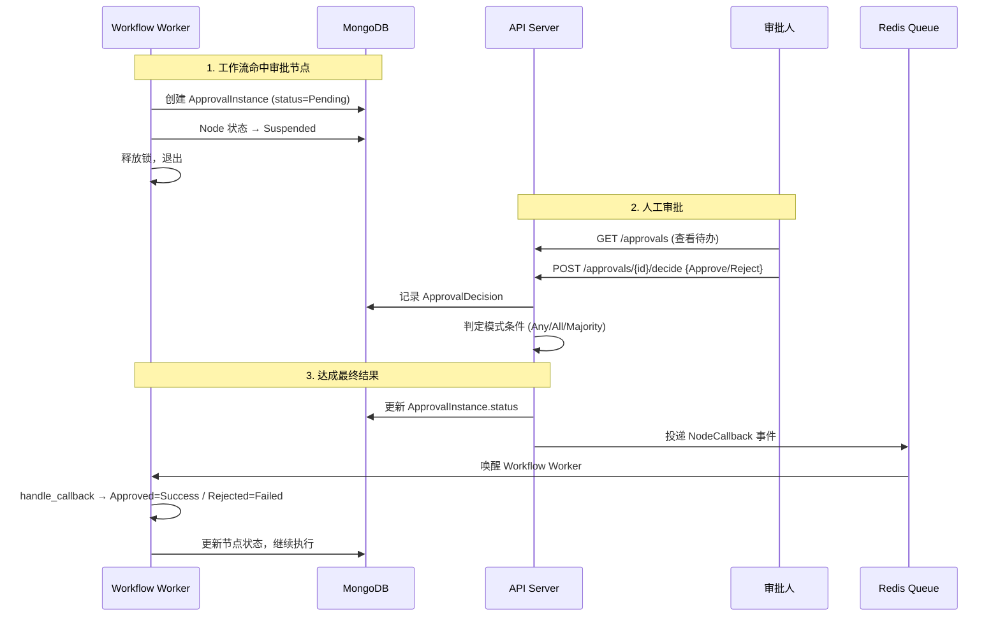

# 分布式工作流引擎架构设计文档

本文档详细描述了本工作流引擎的架构设计、插件化系统、以及调度器与执行器之间的交互流转模型。

## 1. 核心架构设计

引擎采用了 **编排器 (Orchestrator)** 与 **执行器 (Executor)** 分离的微服务架构。通过分布式的消息队列（当前为 Apalis + Redis），将系统拆分为两类独立运行的 Worker 节点。

### 1.1 Worker 角色划分

1. **Workflow Worker (编排器)**
   * **职责**：负责工作流有向图的拓扑迭代、状态机流转、执行上下文（Context）的维护与传递、插件控制流的决策。
   * **行为**：它本身**不执行**任何诸如 HTTP 请求或脚本解析等重量级耗时操作。当执行到一个动作节点（如 HTTP 请求）时，它只负责生成一张任务执行工单，丢给队列，然后就挂起休眠，释放计算资源。

2. **Task Worker (执行器)**
   * **职责**：负责干脏活累活。从任务队列中抓取任务，调用具体的 `TaskExecutor`（如 `HttpTaskExecutor`）发起实际的网络请求、执行脚本等。
   * **行为**：执行完成后，负责将结果（Output、Error等）打包成事件（Event），反向投递给工作流队列，通知对应的 Workflow Worker 醒来收工。

### 1.2 架构交互图



### 1.3 WorkflowInstance 状态机（统一语义）

为避免 `Suspended` 语义混淆（人工暂停 vs 技术性等待），状态机约束如下：

| 当前状态 | 触发事件 | 目标状态 | 说明 |
|------|------|------|------|
| `Pending` | Worker 拉起执行（Start） | `Running` | 进入执行态 |
| `Running` | 分发异步子任务后让出 CPU | `Await` | 系统等待回调，不是人工暂停 |
| `Running` | 审批节点进入人工等待 | `Suspended` | 仅人工介入场景 |
| `Running` | 正常结束 | `Completed` | 终态 |
| `Running` | 执行失败 | `Failed` | 终态（可重试） |
| `Running` | 用户取消 | `Canceled` | 终态 |
| `Await` | 收到回调并恢复调度 | `Pending` | 统一回到安全边界，再由 Worker 重新进入 `Running` |
| `Await` | 用户取消 | `Canceled` | 终态 |
| `Suspended` | 用户恢复/审批通过 | `Pending` | 不允许直达 `Running`，避免无锁恢复风险 |
| `Suspended` | 用户取消 | `Canceled` | 终态 |
| `Failed` | 用户重试 | `Pending` | 重新调度 |

关键约束：

1. `Await -> Pending`（禁止 `Await -> Running`）
2. `Suspended -> Pending`（禁止 `Suspended -> Running`）
3. `Pending` 是统一安全边界，只有 Worker 持锁执行时才进入 `Running`

### 1.4 工作流/任务实例：重试、取消、级联通知与跳过节点（规划）

本节在 **§1.3 状态表** 与现有 `WorkflowInstanceStatus` / `TaskInstanceStatus` / `NodeExecutionStatus` 之上，约定**可落地方案**（含与当前实现的差距），用于统一后端、API 与前端产品行为。

#### 编排驱动的统一事件入口（定案：方案 A）

工作流 Worker **只做编排**；正常路径是执行器 / 子工作流完成后投递 **`ExecuteWorkflowJob { event: NodeCallback, ... }`**，经 **`process_workflow_job`** 进入各插件 **`handle_callback`**，再推进图与派发下一批任务。

**方案 A（已定）**：凡属于「**某节点在持久化侧已有终态结论，需与执行器回调走同一套合并与推进逻辑**」的人工操作（典型：**跳过节点**、以及需与回调同路径处理的其它节点级干预），在 **API 完成 CAS 落库** 之后，应 **`dispatch_workflow(ExecuteWorkflowJob { event: NodeCallback, ... })`**，**与 Task Worker 使用同一事件形态、同一 Worker 入口**，不得在 HTTP Handler 内直接跑引擎循环。

**与 `Start` 的分工**：**`WorkflowEvent::Start`** 仍用于实例处于 **`Pending`** 时**进入主循环**（创建后首次执行、`Failed` / `Suspended` 经 **retry / resume** 回到 `Pending` 后的**整实例再调度**）。`Start` 与 `NodeCallback` **并列**，均属 **Redis/Apalis 上的 `ExecuteWorkflowJob`**，仅事件变体不同；**禁止**在 API 线程内内联执行 `run_loop`。

#### 持久化与队列的两阶段（强制）

| 阶段 | 职责 | 说明 |
|------|------|------|
| **1. 持久化** | 状态机迁移 + 节点/图数据与执行器结果**对齐**（如 skip 写入 `Skipped` + `output`、`current_node`） | 可由独立 API 或单接口内**先**完成写库。 |
| **2. 投递** | **`dispatch_workflow`** 或 **`dispatch_task`** | 仅发 Job，**不**在 Handler 内执行编排逻辑。 |

单接口内允许 **「写库 → 投递」** 顺序实现，但**语义上**仍分两阶段；前端也可拆成两个 API。**禁止**绕过队列直接调插件。

#### 1.4.1 术语与目标

| 维度 | 说明 |
|------|------|
| **工作流实例** | **retry** / **resume**：`→ Pending` 后投递 **`Start`**（与创建后 **execute** 对称）。**跳过**等节点级结论：落库后投递 **`NodeCallback`（方案 A）**。**取消**：`Failed` / `Suspended` → `Canceled`（一般不再投递编排 Job；若需唤醒父链，另议）。 |
| **原子任务实例** | **retry** `Failed→Pending` 后由 **`ExecuteTaskJob`**（**execute**）触发；嵌在工作流内时，父侧延续见 §1.4.4。 |
| **级联** | 父/子状态在**阶段 1** 修正后，**阶段 2** 对父投递 **`NodeCallback` 或 `Start`**（与执行器回调同级），保持「**事件流转通知工作流**」一致。 |
| **跳过节点** | 仅在 **§1.4.5** 安全窗口内；**`output` 由用户填写，允许 `{}`**，见下。 |

#### 1.4.2 工作流实例：后端能力（与 §1.3 对齐）

| 操作 | 状态前置 | 持久化 | 阶段 2 投递（约定） |
|------|----------|--------|---------------------|
| **execute** | `Pending` | `→ Running` | **`WorkflowEvent::Start`**（已有）。 |
| **retry** | `Failed` | `→ Pending` | **`Start`**（整实例从安全边界再跑）。 |
| **resume** | `Suspended` | `→ Pending` | **`Start`**。 |
| **cancel** | `Failed` / `Suspended` | `→ Canceled` | 通常无；若需通知父子链，可用 **`NodeCallback`** 表达终态（实现期定）。 |

**`Await` 下用户取消**：§1.3 表已列；若实现，需扩展状态机，并对滞留队列回调 **幂等丢弃**。

#### 1.4.3 原子任务实例：后端能力

| 操作 | 前置 | 持久化 | 阶段 2 |
|------|------|--------|--------|
| **execute** | `Pending` | `→ Running` | **`dispatch_task`**。 |
| **retry** | `Failed` | `→ Pending` | 由 **execute** 或级联后的父 **`Start`/`NodeCallback`** 触发子任务再投；级联写库见 §1.4.4。 |
| **cancel** | `Pending` / `Failed` | `→ Canceled` | 一般无 Task Job。 |

#### 1.4.4 `NodeCallback`（方案 A）字段约定与级联

与 **§1.2 架构交互图**、`ExecuteWorkflowJob` / `WorkflowEvent` 一致，人工注入与 Task Worker **共用**下列字段语义（实现上 **`handle_callback` 须幂等**，重复投递不破坏状态）：

| 字段 | 约定 |
|------|------|
| `node_id` | 工作流图中节点；跳过 / 重放结论所指向的节点。 |
| `child_task_id` | **优先**使用该节点当前嵌套 **`task_instance.task_instance_id`**，与真实回调对齐，便于插件复用合并逻辑；若尚无任务行，可用租户内约定占位 id，插件需分支处理。 |
| `status` | `NodeExecutionStatus`；**跳过**建议 **`Skipped`**（或 **`Success`** + `output` 与 **`Skipped` 节点态** 二选一，全项目统一一种）。 |
| `output` / `error_message` / `input` | 与 **阶段 1 已写入 DB** 的内容一致，避免回调与库双源不一致。 |

**级联（任务实例页重试、子工作流等）**：

1. **阶段 1**：按失败点修正 **子 `task_instance`、父 `WorkflowNodeInstanceEntity`、父 `WorkflowInstanceEntity`**（如父 `Failed→Pending`、`current_node` 等）。  
2. **阶段 2**：对**应继续的实例** `dispatch_workflow`：**父** 上投递 **`Start`**（若整父已 Pending）或 **`NodeCallback`**（若等价于「某父节点收到子结果」）；**子** 再跑则 **`dispatch_task`**。  
3. **子工作流完成通知父**：仍走现有 **子终态 → `NodeCallback` 父**（不变）。  

**禁止**：在 API 中伪造不完整 `NodeCallback` 导致 `handle_callback` 与锁/epoch/子任务 id 冲突；**必须**与持久化视图一致。

#### 1.4.5 跳过节点（Skip）

**目标**：不执行该节点逻辑，但将其视为在数据面上**已有输出**（可为空对象），以便下游 **`nodes.<id>.output`**（§8.6）继续解析。

**`output`（统一字段，无额外别名）**

- Body 提供 **`node_id`** 与 **`output`**（JSON 对象）。**用户须提交 `output`，允许为 `{}`**。  
- 持久化：节点 **`Skipped`**，该节点 **`task_instance.output = output`**（与成功节点一样占用同一字段，**不**引入 `synthetic_output` 等额外名）。  
- **`build_nodes_object`**：`Skipped` 且 **`output` 已落盘**（含 `{}`）→ 生成 **`nodes.<id>.output`**，复用现有模板解析链。

**允许跳过的工作流实例状态**（安全窗口）：**`Failed`**、**`Suspended`**（一期规则可再收紧）；**`Parallel` / `ForkJoin` 父节点** 一期建议禁止或单独规则。

**算法要点**：

1. **阶段 1**：校验租户与状态窗口；写 **`Skipped`** + **`output`**；按模板更新 **`current_node`**（If 分支需产品约定）；实例若需回到 **`Pending`** 以便后续 **`Start`**，一并写入。  
2. **阶段 2**：**`dispatch_workflow(ExecuteWorkflowJob { event: NodeCallback, node_id, child_task_id, status: Skipped, output: … })`**（字段与库一致），由 **`handle_callback`** 与执行器回调**同路径**推进（具体由插件实现吸收 `Skipped`）。  

**审计（二期）**：`skipped_at`、`skipped_by`、`reason` 可选字段。

#### 1.4.6 前端（与 `docs/frontend-architecture.md` 对齐）

| 页面 | 行为 |
|------|------|
| **工作流实例** | **execute** 对应 **`Start`**；跳过在 UI 收集 **`output`（默认 `{}`）** 后提交；可提供「提交后由后端写库并投递」的单按钮。 |
| **任务实例** | 重试/级联后父侧依赖 **`Start`/`NodeCallback`** 的，提示与架构 §1.4.4 一致。 |

#### 1.4.7 实施阶段建议

| 阶段 | 内容 |
|------|------|
| **P0** | **`build_nodes_object`** 支持 `Skipped`+`output`；skip API **阶段1+2**；**`handle_callback`** 对人工 **`NodeCallback`** 幂等；retry/resume 后 **`Start`** 路径与现网对齐。 |
| **P1** | 任务页级联写库 + 父 **`Start`/`NodeCallback`**；子工作流与父一致性；`Await` 取消。 |
| **P2** | 容器 skip、队列补偿、审计。 |

---

## 2. 插件化系统 (Plugin System)

为了让系统拥有极强的扩展能力，我们将任务的抽象剥离成了两层接口：**编排插件接口 (`PluginInterface`)** 与 **执行器接口 (`TaskExecutor`)**。

### 2.1 编排插件 (`PluginInterface`)

该接口存在于 Workflow Worker 的上下文中。**它是工作流的路由大脑，而非干活的苦力。**
主要用于实现：如何发射子任务、遇到子任务回调时如何合并状态、如何进行分支跳转（如 If 条件）等控制流逻辑。

```rust
#[async_trait]
pub trait PluginInterface: Send + Sync {
    // 【前置逻辑】当工作流运行到该节点时触发。
    // 一般用于：解析配置、生成并向下分发 ExecuteTaskJob、或者针对控制流节点(IfCondition)直接返回跳到哪。
    async fn execute(...) -> anyhow::Result<ExecutionResult>;

    // 【后置回调逻辑】当远端的 Task Worker 汇报“任务已完成”时触发。
    // 一般用于：普通节点直接拷贝结果并完结；并发节点(Parallel)做数据聚合和增量派发。
    async fn handle_callback(...) -> anyhow::Result<ExecutionResult>;
    
    fn plugin_type(&self) -> TaskType;
}
```

**代表实现**：
* `HttpPlugin`：`execute` 里构造一条任务工单推到队列，直接返回 `Pending` 挂起。`handle_callback` 里直接接收结果，返回 `Success`。
* `IfConditionPlugin`：不需要队列交互。`execute` 里直接运行表达式库，算出来 `true` 还是 `false`，当即返回 `Success(JumpTo(TargetNode))` 告知工作流下一跳转去哪里。
* `ParallelPlugin`：并发大杀器，接下来详述。

### 2.2 任务执行器 (`TaskExecutor`)

该接口存在于 Task Worker 的上下文中。它的职责极其单一：拿到一段静态的输入参数，把它跑完，返回一段静态的输出结果。

```rust
#[async_trait]
pub trait TaskExecutor: Send + Sync {
    async fn execute_task(&self, task_instance: &TaskInstanceEntity) -> anyhow::Result<TaskExecutionResult>;
    fn task_type(&self) -> TaskType;
}
```

---

## 3. 并发容器 (Parallel Plugin) 深度剖析

`Parallel` 并不是一个普通的“执行某段代码”的节点，它是一个 **Scatter-Gather (分散-聚合)** 模式的微型调度器本身。
由于它可能需要遍历处理 10 万条数据的数组，因此**坚决不能**在一次 `execute` 里把 10 万条队列任务全部发出，这会瞬间造成内存 OOM 和 Redis 拥堵。

因此，Parallel 借助了我们的 `NodeCallback` 内部事件机制，实现了一个非常精妙的状态机。

### 3.1 状态机存储

Parallel 借用了它自身的 `TaskInstanceEntity.output` 来充当状态机的内存条，并利用 MongoDB 作为持久化存储（即便引擎宕机重启，进度也能从 DB 恢复）。
```json
{
  "total_items": 1000,
  "dispatched_count": 10,
  "success_count": 0,
  "failed_count": 0
}
```

### 3.2 增量控制流 (Scatter & Gather)

1. **首次执行 (Scatter 播种)**
   在 `ParallelPlugin::execute` 中，只解析目标数组大小（如 1000）。并且**仅仅**根据设定的 `concurrency` 阈值（如 10），生成**前 10 个** `ExecuteTaskJob` 扔进任务队列，并记录 `dispatched_count = 10`。
   > **关键点**：这发出去的 10 个 Job 中，它的 `caller_context` 里携带了 `parent_task_instance_id` (指向这个 Parallel 的 ID)，以及自己代表的是数组里的第 `item_index` 个元素。

2. **异步回调与增量补货 (Gather 收获)**
   随着 Task Worker 并发执行这 10 个任务，会有捷足先登者完成并向 Workflow Worker 发射 `NodeCallback` 事件。
   事件流转进入 `ParallelPlugin::handle_callback`，在此进行如下决断：
   
   * **状态聚合**：根据子任务的成败，对 `success_count` 或 `failed_count` 进行加一。
   * **失败熔断**：检测 `failed_count > max_failures`。若超过容忍度，整个 Parallel 立即短路失败，抛弃未执行的任务。
   * **完成检测**：若 `success_count + failed_count == total_items`，全员收工，向引擎返回 `Success` 推动主流程前行。
   * **并发补货**：如果既未熔断也未完成，则根据并发模式开始派发新任务：
     * **Rolling (滚动模式)**：犹如滑动窗口，走了一个补一个，立即派发第 `dispatched_count` 号任务给队列，保证全速满负荷运转。
     * **Batch (批量模式)**：按兵不动，直到前 10 个任务全部死活出结果了，才一次性把后 10 个任务发出。

通过这种“任务唤醒自己”的设计（Event-Driven Callback），系统不仅做到了完美解耦，而且拥有了抵抗海量数据冲击的弹性能力。

### 3.3 节点可观测性（单一数据源）

工作流节点**不再**使用 `WorkflowNodeInstanceEntity.output`。节点在运行时的**入参与出参**一律落在嵌套的 `TaskInstanceEntity` 上：

| 字段 | 含义 |
|------|------|
| `task_instance.input` | **解析后**的执行入参快照。对 HTTP 任务：`url` 与 `headers`/`body`/`form` 各行按下文规则解析后写入；其它插件各自定义形状。供排障与审计；各插件在 `execute` / 默认或自定义 `handle_callback` 中写入。 |
| `task_instance.output` | 节点/任务对外结果（HTTP 响应摘要、If 分支结果、Parallel 父节点状态 JSON、ContextRewrite 的 key 列表等）。 |

**HTTP**：Workflow Worker 在 `run_node` 合并变量后调用 `resolved_http_request_snapshot` 写入**嵌套在流程实例节点上的** `task_instance.input`；投递异步任务前，`ensure_task_instance_for_job` 在 `task_instances` 集合中创建（或复用）与 `task_instance_id = {workflow_instance_id}-{node_id}` 对应的行。**图上的 HTTP 节点**必须把同一份已解析 `input` 写入该行：任务 Worker 只读 `task_instances`，若此处 `input` 为空，`HttpTaskExecutor` 会用空上下文重算，导致 `Variable` 模板中的 `{{}}` 无法替换。Parallel/ForkJoin 子任务在该函数内按 `item_alias` + `items_path` 或父节点 `context` 生成解析后的 `input`。执行器优先使用快照发请求，并在回调中回传同一快照。**禁止**在节点层再维护一份 `output`，避免双写不一致。

**HTTP 模板中 `FormValueType`（`headers` / `body` / `form` 每一行）**（实现：`domain::task::http_template_resolve`）：

- **任务级 `form` 与 `url`/`headers`/`body` 的先后**：先将模板 **`form` 数组**的每一行按 **base 上下文**（租户 / 工作流 / 实例 / 节点合并结果，见 §8.5–8.6）解析为键值对象，再将其 **覆盖合并** 到 base 上得到 **effective_ctx**（**同名键以任务 `form` 为准**）。**`url`、`headers`、`body`** 中的占位符与 `Variable` 行均按 **effective_ctx** 解析。快照 JSON 里的 **`form` 字段**仍为各 `form` 行在 **base 上下文**下的解析结果（任务级绑定层本身），便于对照设计态默认值。
- **`String` / `Number` / `Bool` / `Json`**：字面量。字符串中的 `{{...}}` **不会**被解析，便于需要原样传输占位符文案的场景。
- **`Variable`**：对字符串值做 **`{{点路径}}` 模板替换**（可整段为 `{{name}}`，也可混写为 `prefix {{name}} suffix`）；查找路径在 **effective_ctx** 上解析（故可由任务 `form` 提供 `body` 中引用的键）。
- **`url` 字段**（非表单行）：整段 URL 对 **effective_ctx** 做 `{{点路径}}` 占位符解析。

**破坏性说明**：曾依赖「`type: String` + 值里写 `{{key}}`」实现动态 Headers/Body 的旧数据，需改为 **`type: Variable`** 后才会继续解析。

**脱敏**：生产环境若需对 Secret 打码，在写入 `input`/`output` 前增加策略层（当前迭代未实现）。

---

## 4. 分布式锁与数据一致性 (CAS)

在分布式环境中，同一个工作流实例可能因为并发的回调（如 Parallel 节点的多个子任务同时完成）被多个 Workflow Worker 同时唤醒。为了防止“更新丢失（Lost Update）”和“数据撕裂”，引擎在 `WorkflowInstanceEntity` 中设计了乐观锁与租约机制：

```rust
pub struct WorkflowInstanceEntity {
    // ...
    pub epoch: u64, // 乐观锁版本号
    pub locked_by: Option<String>, // 当前持有该工作流锁的 Worker ID
    pub locked_duration: Option<std::time::Duration>, // 锁的过期时间（租约）
}
```

### 4.1 字段设计与租约 (Lease) 机制

* **`epoch` (乐观锁版本号)**：每次对 `WorkflowInstanceEntity` 的成功修改并持久化到 MongoDB 时，`epoch` 都会原子性加 1。任何 Worker 在更新时都必须携带自己读取到的 `epoch` 进行 CAS（Compare-And-Swap）操作。若数据库中实际 `epoch` 不匹配，说明数据已被其他 Worker 修改，当前更新操作被拒绝并触发重试。
* **`locked_by` 和 `locked_duration` (悲观租约)**：为了防止多个 Workflow Worker 频繁争抢同一个工作流实例导致的 CAS 冲突风暴（尤其在 Parallel 密集回调时），引擎引入了“租约”概念。当一个 Worker 认领了工作流事件，它会设置 `locked_by = "self_worker_id"` 并给予一定的锁定时长（如 10 秒）。
  * 在租约期间内，其他 Worker 哪怕收到了唤醒该工作流的事件，也需要让步或等待。
  * 如果持有锁的 Worker 崩溃宕机，租约（`locked_duration`）到期后，“扫地僧”机制或其他 Worker 即可重新抢占该实例，保证不会产生永远卡死在 Running 状态的孤儿任务。

### 4.2 并发容器 (Parallel) 回调的 CAS 演进过程

在 Parallel 节点运行中，假设有 100 个 HTTP 子任务被并发扔到 Task Worker 执行。随着任务快速完成，它们会密集地向 Workflow Worker 推送 `NodeCallback` 唤醒事件。

在这个场景下，数据的流转与 `epoch` 的变化如下：

1. **并发唤醒冲突**：子任务 A 和子任务 B 几乎同时完成，向队列中推入了两个 `NodeCallback` 事件。
2. **锁争抢阶段**：
   * Worker 1 消费到 A 的事件，Worker 2 消费到 B 的事件。
   * 它们同时去 MongoDB 读取 `WorkflowInstance`（当前 `epoch = 5`，无锁）。
   * Worker 1 和 Worker 2 尝试通过 CAS (条件 `epoch == 5` 且未被锁定) 抢占这把锁并更新。
   * MongoDB 的原子性保证了只有一个能赢，假设 Worker 1 赢了，此时 MongoDB 里 `locked_by = "Worker-1"`, `epoch` 变为 `6`。
3. **退让与事件不丢失 (Retry机制)**：
   * Worker 2 更新失败（受制于 CAS 检查 `epoch == 5` 失败，或发现被锁定），它会抛出 `OptimisticLockError` 或者 `LeaseLockedError`。
   * **如何确保事件不丢失**：因为底层的任务队列（Apalis/Redis）支持 **ACK/NACK 机制**。Worker 2 在处理该 `NodeCallback` 事件时一旦遇到数据库层面的乐观锁失败报错，它**不会向队列发送 ACK**。相反，它会向队列发送一个 NACK（或者让事件超时），这导致该 `NodeCallback` 事件会重新回到队列中（或进入重试死信队列），并在短暂的延迟后被 Worker 2 或其他 Worker 重新消费。
4. **安全处理状态**：
   * Worker 1 在租约保护下，安全地进入 `ParallelPlugin::handle_callback`，将状态机中的 `success_count` +1。
   * 处理完毕后，Worker 1 执行 Save 释放锁，此时 CAS 更新条件为 `epoch == 6`，更新成功后释放 `locked_by`，`epoch` 变为 `7`。
5. **后续唤醒**：
   * Worker 2 的重试机制再次触发，重新从 MongoDB 加载最新的状态（此时 `epoch = 7`，`success_count` 已经被加过 1 了）。
   * Worker 2 抢占成功（`epoch` 变 8），处理子任务 B 的回调，再次把 `success_count` +1，完成后释放，`epoch` 变 9。

**结论**：在密集回调的 Gather 阶段，虽然大量的子任务完成事件如洪水般涌向 Workflow Worker，但依靠 `epoch` (CAS乐观锁) 保证了 `success_count` 等共享数据绝对不会被并发覆盖；同时依靠 `locked_by` (租约) 减缓了冲突摩擦，保障了系统在极致并发下的数据强一致性。

---

## 5. 异构并发容器 (ForkJoin Plugin) 深度剖析

### 5.1 Parallel vs ForkJoin

| 维度 | Parallel (同构并发/数据并行) | ForkJoin (异构并发/任务并行) |
|------|------|------|
| 数据源 | 一个 JSON 数组 × 同一个任务模板 | N 个**不同的** TaskTemplate |
| 子任务类型 | 全部相同（如全是 HTTP） | 可以不同（HTTP + gRPC + ...） |
| 典型场景 | "给 1000 个用户各发一封邮件" | "同时拉用户数据 + 发通知 + 生成报告" |
| 并发控制 | concurrency + Rolling/Batch | 同样 concurrency + Rolling/Batch |
| 失败控制 | max_failures | 同样 max_failures |

二者本质上共享同一套 Scatter-Gather + Callback 状态机，区别仅在于数据源：Parallel 从数组动态展开 N 个相同任务，ForkJoin 从静态列表展开 N 个不同任务。

### 5.2 模板定义

```rust
pub struct ForkJoinTemplate {
    pub tasks: Vec<ForkJoinTaskItem>,   // 子任务列表
    pub concurrency: u32,               // 并发度
    pub mode: ParallelMode,             // Rolling / Batch
    pub max_failures: Option<u32>,      // 最大失败容忍数
}

pub struct ForkJoinTaskItem {
    pub task_key: String,               // 容器内唯一标识 (results map 索引键)
    pub task_id: Option<String>,        // 关联的 TaskEntity ID (仅独立任务如 Http/gRPC)
    pub name: String,                   // 可读名称
    pub task_template: TaskTemplate,    // 任意原子任务模板 (Http, gRPC, ...)
}
```

### 5.3 子任务类型约束

由于引擎采用 Workflow Worker (编排) / Task Worker (执行) 双角色分离架构，容器类插件 (`Parallel`, `ForkJoin`) 和控制流插件 (`IfCondition`) 仅有 `PluginInterface` 实现（编排侧），没有 `TaskExecutor` 实现（执行侧）。

因此：**容器的子任务只能是拥有 `TaskExecutor` 的原子任务类型**（Http, gRPC, Approval 等）。

```
ForkJoin.execute()
  → 派发子任务 ExecuteTaskJob(template=Parallel)
  → Task Worker 消费
  → TaskManager 找不到 Parallel 的 TaskExecutor ❌
```

如需嵌套容器逻辑，正确的做法是将内层容器建模为一个**子工作流**，由 Workflow Worker 独立编排。

### 5.4 状态机存储

与 Parallel 一样借用 `TaskInstanceEntity.output`，但额外包含 `results` Map 用于按 `task_key` 索引每个子任务的执行结果：

```json
{
  "total_tasks": 3,
  "dispatched_count": 3,
  "success_count": 1,
  "failed_count": 0,
  "results": {
    "fetch_user": { "status": "Success", "output": { ... } },
    "send_email": { "status": "Failed", "error": "timeout" },
    "notify_slack": null
  }
}
```

后续节点可通过 `task_key` 精确引用某个子任务的输出结果。

#### task_id 与 task_key 的区分

- **`task_key`**：容器内唯一标识，作为 `results` map 的键，供后续节点引用子任务输出。值为人类可读标签（如 `"create_user"`）。
- **`task_id`**：可选，关联独立注册的 `TaskEntity` 记录（UUID）。仅对 Http、gRPC 等可独立存在的原子任务有意义；对工作流内部插件（IfCondition、ContextRewrite 等）或子工作流（已有 `SubWorkflowTemplate.workflow_meta_id`）无需填写。子任务实例化时，`task_id` 会传播到 `TaskInstanceEntity.task_id`，实现来源追溯。

Parallel 节点的 `task_id` 追溯通过 `WorkflowNodeEntity.task_id` 实现（编排时由客户端填写），因为 Parallel 内部仅有一种同构任务模板。

### 5.5 Scatter & Gather 流程

**Scatter (execute)**：读取 `tasks` 列表 → 初始化状态机 → 按 `concurrency` 派发前 N 个子任务 → `caller_context.item_index` 记录子任务在列表中的索引。

**Gather (handle_callback)**：与 Parallel 共享完全相同的决策逻辑（状态聚合 → 失败熔断 → 完成检测 → 并发补货），唯一区别是额外将结果写入 `results[task_key]`。

---

## 6. 子工作流嵌套 (SubWorkflow Plugin)

工作流之间没有高低之分，任何工作流都可以作为另一个工作流中的一个节点被调用。SubWorkflow 节点本质上与 Http、Parallel 处于同一层次——都是工作流图中的一个节点。区别仅在于：Http 投递任务给 Task Worker，而 SubWorkflow 投递的是**一个全新的工作流实例**给 Workflow Worker。

### 6.1 模板定义

```rust
pub struct SubWorkflowTemplate {
    pub workflow_meta_id: String,    // 引用哪个工作流
    pub workflow_version: u32,       // 指定版本
    pub form: Vec<Form>,             // 传递给子工作流的初始上下文参数，与目标工作流 form 定义对齐
    pub timeout: Option<u64>,        // 超时（秒）
}
```

> `form` 替代了原 `input_mapping`。发起子工作流等同于发起工作流实例：指定 meta_id + version，填写 form 参数并**按存储的 `Form` 值合并进子实例初始上下文**（当前实现为序列化后的字面量合并，**不经** HTTP 任务同款 `Variable`/`{{}}` 解析）。若需从父上下文映射字段，应在编排或其它层显式建模。

### 6.2 实体扩展

`WorkflowInstanceEntity` 新增两个字段：

```rust
pub struct WorkflowInstanceEntity {
    // ... 原有字段 ...
    pub parent_context: Option<WorkflowCallerContext>, // 若自己是子工作流，记录父工作流信息
    pub depth: u32,                                    // 嵌套深度，根工作流=0
}
```

### 6.3 执行时序



### 6.4 父回调机制

子工作流到达终态（Completed / Failed）后，`PluginManager::process_workflow_job` 在释放锁之前检查 `parent_context`：

* 若 `parent_context` 非空 → 向父工作流投递 `NodeCallback` 事件（携带子工作流的上下文作为 output）
* 若为空 → 根工作流，正常结束

这与 Task Worker 完成后回调父工作流的机制**完全一致**，复用了同一套 `NodeCallback` 事件通道。

### 6.5 防循环递归

| 策略 | 说明 |
|------|------|
| 深度限制 | `depth` 字段每嵌套一层 +1，超过 `MAX_DEPTH`（默认 10）直接拒绝 |

子工作流的 `handle_callback` 直接使用 `PluginInterface` trait 的默认实现——子工作流的完成状态和输出直接映射为父节点的状态。

---

## 7. 多租户系统 (Multi-Tenancy)

### 7.1 设计总则

系统从数据模型层面原生支持多租户，所有工作流和原子任务均携带 `tenant_id`。租户隔离的**唯一门禁**在 API Server 侧，执行引擎（Worker）对租户完全无感知，只按 Job 维度执行。

```
请求 → [AuthMiddleware] → [TenantGuard] → [PermissionGuard] → Handler
         ↓                    ↓                 ↓
    验证 JWT Token       校验租户状态         检查角色权限
    解析 AuthContext      注入 tenant_id      匹配路由所需权限
```

### 7.2 核心实体

**租户表 (TenantEntity)**

| 字段 | 类型 | 说明 |
|------|------|------|
| tenant_id | String | 主键 |
| name | String | 租户名称 |
| description | String | 描述 |
| status | TenantStatus | Active / Suspended / Deleted |
| max_workflows | Option\<u32\> | 配额：最大工作流模板数 |
| max_instances | Option\<u32\> | 配额：最大运行实例数 |

**用户表 (UserEntity)**

| 字段 | 类型 | 说明 |
|------|------|------|
| user_id | String | 主键 |
| username | String | 唯一 |
| email | String | 唯一 |
| password_hash | String | bcrypt 哈希 |
| is_super_admin | bool | 系统级超管标记 |
| status | UserStatus | Active / Disabled |

**用户-租户角色关联表 (UserTenantRole)**

| 字段 | 类型 | 说明 |
|------|------|------|
| user_id | String | 外键 |
| tenant_id | String | 外键 |
| role | TenantRole | TenantAdmin / Developer / Operator / Viewer |

### 7.3 角色与权限矩阵

| 权限域 | SuperAdmin | TenantAdmin | Developer | Operator | Viewer |
|--------|:---:|:---:|:---:|:---:|:---:|
| 租户管理（创建/暂停/删除） | ✅ | ❌ | ❌ | ❌ | ❌ |
| 跨租户访问 | ✅ | ❌ | ❌ | ❌ | ❌ |
| 租户内用户管理 | ✅ | ✅ | ❌ | ❌ | ❌ |
| 工作流/任务模板 CRUD | ✅ | ✅ | ✅ | ❌ | ❌ |
| 实例 创建/执行/取消/重试 | ✅ | ✅ | ✅ | ✅ | ❌ |
| 只读查看 | ✅ | ✅ | ✅ | ✅ | ✅ |

### 7.4 JWT Token 设计

```json
{
  "sub": "user_id",
  "username": "alice",
  "is_super_admin": false,
  "tenant_id": "tenant_001",
  "role": "Developer",
  "exp": 1700000000
}
```

SuperAdmin 可通过 `X-Tenant-Id` Header 代入任意租户上下文。

### 7.5 数据隔离

所有 Repository 查询自动携带 `tenant_id` 过滤条件。Handler 从 `AuthContext` 获取 `tenant_id` 传递给 Service/Repository 层，确保数据不会跨租户泄漏。

### 7.6 API 路由

```
/api/v1/auth             ← 公开（无需 JWT）
  POST /login
  POST /register

/api/v1/tenants          ← SuperAdmin 专属
  CRUD

/api/v1/tenants/users    ← TenantAdmin+
  邀请/移除/改角色

/api/v1/workflow         ← 以下全部 tenant_id 自动隔离
/api/v1/task
```

---

## 8. 变量系统 (Variable System)

### 8.1 设计总则

变量系统为工作流引擎提供了统一的外部配置注入能力。用户可以在不修改工作流模板的前提下，通过变量来改变运行时行为（如切换 API 地址、注入凭证等）。变量按作用域分层，越靠近执行现场的变量优先级越高。

### 8.2 变量层级与优先级

| 优先级 | 层级 | scope_id | 说明 | 来源 |
|:------:|------|----------|------|------|
| 1 (最低) | **租户变量** | `tenant_id` | 全租户共享的基础配置 | `VariableEntity (scope=Tenant)` |
| 2 | **工作流模板变量** | `workflow_meta_id` | 某个工作流的默认配置 | `VariableEntity (scope=WorkflowMeta)` |
| 3 | **工作流实例变量** | `workflow_instance_id` | 运行时传入的上下文 | `WorkflowInstanceEntity.context` |
| 4 | **节点上下文** | `node_id` | 单节点的局部覆盖（模板拷贝 + 运行期合并结果） | `WorkflowNodeInstanceEntity.context`（初值来自 `WorkflowNodeEntity.context`） |
| 5 (执行期最高) | **系统 `nodes`** | — | 仅保留字顶层键 `nodes`：已完成节点的输出引用 | 由引擎在 `resolve_variables` **之后**注入，**覆盖**合并结果中与 `nodes` 同名的用户键 |

> 优先级 1～4 由 `VariableService::resolve_variables` 合并；**越靠近执行代码越高**。优先级 5 仅作用于顶层键 `nodes`：编排者不应在实例 `context` 中依赖自定义 `nodes` 键（会被系统覆盖）。变量系统为优先级 1、2 新增持久化实体；3、4 来自现有实体字段。

### 8.3 变量实体

```rust
pub enum VariableScope {
    Tenant,        // 租户级
    WorkflowMeta,  // 工作流模板级
}

pub enum VariableType {
    String,
    Number,
    Bool,
    Json,
    Secret,  // 加密存储，API 掩码返回
}

pub struct VariableEntity {
    pub id: String,
    pub tenant_id: String,
    pub scope: VariableScope,
    pub scope_id: String,          // tenant_id 或 workflow_meta_id
    pub key: String,               // 变量名，scope_id + key 唯一
    pub value: String,             // 存储值（Secret 类型 AES-256-GCM 加密）
    pub variable_type: VariableType,
    pub description: Option<String>,
    pub created_by: String,        // user_id
    pub created_at: DateTime<Utc>,
    pub updated_at: DateTime<Utc>,
}
```

### 8.4 变量类型与安全策略

| 类型 | 存储方式 | API 响应 | 引擎解析 |
|------|----------|----------|----------|
| `String` | 明文 | 明文 | 原样注入 |
| `Number` | 明文 | 明文 | 解析为 `f64` |
| `Bool` | 明文 | 明文 | 解析为 `bool` |
| `Json` | 明文 JSON | 明文 | 解析为 `serde_json::Value` |
| `Secret` | **AES-256-GCM 加密** | `"******"` 掩码 | **运行时解密注入，不落盘到 output** |

加密密钥来源于环境变量 `VARIABLE_ENCRYPT_KEY`，缺失时拒绝启动。

### 8.5 变量解析流程

引擎在执行每个节点前，由 `VariableService::resolve_variables` 构造合并后的变量上下文：

```
resolve_variables(tenant_id, workflow_meta_id, instance_context, node_context):
    merged = {}
    merged.extend(load_tenant_variables(tenant_id))          // 优先级 1
    merged.extend(load_workflow_meta_variables(meta_id))      // 优先级 2 覆盖 1
    merged.extend(instance_context)                           // 优先级 3 覆盖 2
    merged.extend(node_context)                               // 优先级 4 覆盖 3
    return merged
```

随后 `PluginManager::run_node` 调用 `augment_merged_context_with_nodes`，在合并结果上**写入/覆盖**顶层键 `nodes`（见下节）。**节点执行前、用于 Rhai 与 HTTP `Variable` 行 / `url` 字段中 `{{}}` 模板解析的最终 JSON** = `merged` + 系统 `nodes`。

Secret 类型的变量在解析阶段解密注入，但**绝不写入** `TaskInstanceEntity.output`，防止凭证泄漏到持久化层。

### 8.6 执行期节点输出命名空间 (`nodes`)

引擎在**每个节点**进入插件逻辑前，在 `resolve_variables` 产物之上注入只读结构的顶层键 `nodes`，供 **IfCondition、ContextRewrite（`ctx`）、HTTP 任务中 `Variable` 类型表单行与 `url` 字段的 `{{path}}`、Parallel 的 `items_path`（经 `WorkflowNodeInstanceEntity.context` 解析）** 等统一引用。

| 规则 | 说明 |
|------|------|
| 形状 | `nodes.<node_id>.output` → 与该 `node_id` 对应的 `TaskInstanceEntity.output`（JSON） |
| 收录条件 | 仅 **非当前节点**、**`task_instance.output` 已落盘**，且节点为 **`Success`**，或 **`Skipped`**（用户填写的 **`output`**，可为 `{}`，见 **§1.4.5**）的图节点 |
| 当前节点 | **不包含**当前正在执行的节点（执行前尚无本次 output，避免自引用） |
| Parallel / ForkJoin | **子任务**（队列子 `TaskInstance`）**不**作为 `nodes` 中的独立条目；仅**容器节点**自身有一条 `nodes.<容器node_id>.output`（如状态机 JSON） |
| 优先级 | 系统构造的 `nodes` **覆盖**合并上下文中同名顶层键 `nodes`（用户不应占用该保留字） |
| 快照语义 | 与「节点级解析上下文」一致：`resolve_variables` 之后的合并结果再注入 `nodes`，再用于生成 `task_instance.input` 快照与 Rhai `ctx` |

实现位于 `domain/workflow/resolution_context.rs`（`build_nodes_object`、`augment_merged_context_with_nodes`）。**`Skipped` + `output`** 纳入 `nodes` 的规则以本文与 **§1.4.5** 为准；代码演进时需与上表「收录条件」对齐。Parallel/ForkJoin **内层** HTTP 子任务在 `ensure_task_instance_for_job` 中使用**父节点**已持久化的 `WorkflowNodeInstanceEntity.context` 作为模板解析基底，从而同样可引用 `nodes.*`。

### 8.7 权限矩阵

| 操作 | SuperAdmin | TenantAdmin | Developer | Operator | Viewer |
|------|:---:|:---:|:---:|:---:|:---:|
| 租户变量 CRUD | ✅ | ✅ | 仅读（Secret 掩码） | 仅读（Secret 掩码） | 仅读（Secret 掩码） |
| 租户 Secret 变量 创建/改值 | ✅ | ✅ | ❌ | ❌ | ❌ |
| 模板变量 CRUD | ✅ | ✅ | ✅ | 仅读 | 仅读 |
| 模板 Secret 变量 创建/改值 | ✅ | ✅ | ✅ | ❌ | ❌ |

### 8.8 API 路由

```
# 租户变量
GET    /api/v1/variables                                    # 列表
POST   /api/v1/variables                                    # 创建
GET    /api/v1/variables/{id}                               # 详情（Secret 掩码）
PUT    /api/v1/variables/{id}                               # 更新
DELETE /api/v1/variables/{id}                               # 删除

# 工作流模板变量
GET    /api/v1/workflow/meta/{meta_id}/variables             # 列表
POST   /api/v1/workflow/meta/{meta_id}/variables             # 创建
GET    /api/v1/workflow/meta/{meta_id}/variables/{id}        # 详情
PUT    /api/v1/workflow/meta/{meta_id}/variables/{id}        # 更新
DELETE /api/v1/workflow/meta/{meta_id}/variables/{id}        # 删除
```

### 8.9 涉及代码变更

| 层级 | 变更 |
|------|------|
| `domain/variable/entity` | 新增 `VariableEntity`、`VariableScope`、`VariableType` |
| `domain/variable/repository` | `VariableRepository` trait |
| `domain/variable/service` | `VariableService`（CRUD + AES 加解密 + `resolve_variables`） |
| `domain/workflow/resolution_context` | `nodes` 注入与合并上下文增强 |
| `infrastructure/mongodb/variable` | MongoDB 实现 |
| `api/handler/variable` | Handler + 权限守卫 |
| `api/router` | 路由挂载 |
| `domain/plugin/manager` | `run_node`：`resolve_variables` 后 `augment_merged_context_with_nodes`；`ensure_task_instance_for_job` 内层 HTTP 使用父节点 `context` |

---

## 9. 上下文重写插件 (ContextRewrite Plugin)

### 9.1 定位

纯计算同步节点，运行在 Workflow Worker（与 IfCondition 同级），**不需要 Task Worker**。在两个节点之间插入一段 Rhai 脚本，对工作流上下文做任意变换，结果写回 `workflow_instance.context` 供后续节点使用。

典型场景：

| 场景 | 说明 |
|------|------|
| 字段提取 | HTTP 响应 `{"data":{"users":[...]}}` → 提取为 `{"users":[...]}` |
| 类型转换 | `"price":"99.5"` → `"price_num":99.5` |
| 数据聚合 | 将 Parallel/ForkJoin 的多个子结果合并为一个汇总对象 |
| 条件赋值 | 根据 `amount > 1000` 设置 `tier = "premium"` |
| 变量重命名/清理 | 去除敏感字段、统一命名规范后传递给下游节点 |

### 9.2 模板定义

```rust
pub struct ContextRewriteTemplate {
    pub name: String,
    pub script: String,          // Rhai 脚本，返回一个 Map
    pub merge_mode: MergeMode,   // Merge(增量覆盖) | Replace(完全替换)
}

pub enum MergeMode {
    Merge,    // 将脚本返回值 merge 进现有 context（默认）
    Replace,  // 用脚本返回值完全替换 context
}
```

### 9.3 Rhai 脚本规范

引擎将 **节点执行前解析上下文** 注入 Rhai 作用域为 `ctx`：即 `resolve_variables` 合并结果再经 **8.6 节** 注入顶层 `nodes` 后的 JSON（与 IfCondition、HTTP 模板同源）。脚本中可通过 `ctx["nodes"]["<node_id>"]["output"]` 读取已成功前置节点的落盘输出。脚本最后一行返回 `#{ ... }` Map 对象。

```rhai
// 示例：字段提取
let users = ctx["response"]["data"]["users"];
#{
    "user_count": users.len(),
    "user_names": users.map(|u| u.name)
}
```

```rhai
// 示例：条件赋值
let tier = if ctx["amount"] > 1000 { "premium" } else { "standard" };
#{
    "customer_tier": tier,
    "discount": if tier == "premium" { 0.2 } else { 0.0 }
}
```

### 9.4 执行流程

```
Workflow Worker 命中 ContextRewrite 节点
  ├─ 1. resolve_variables() 合并变量层级 → merged_ctx
  ├─ 2. augment_merged_context_with_nodes → 写入系统 `nodes`
  ├─ 3. 将上述 JSON 注入 Rhai Scope 为 `ctx`
  ├─ 4. 执行 script，获取返回的 Map
  ├─ 5. Merge 模式 → context.extend(result)
  │     Replace 模式 → context = result
  ├─ 6. 写回 workflow_instance.context
  └─ 7. 返回 ExecutionResult::success()，同步推进
```

### 9.5 安全约束

| 维度 | 策略 |
|------|------|
| 沙箱 | Rhai 内建沙箱，无文件/网络/系统调用能力 |
| 资源限制 | `Engine::set_max_operations(100_000)` 防止死循环 |
| 超时 | 脚本执行超过 5 秒中断，节点标记 Failed |
| Secret 变量 | 经 resolve_variables 解密注入到 ctx，但写回 context 前过滤掉 Secret 变量的 key |

### 9.6 共享 Rhai 引擎

ContextRewrite 与 IfCondition 共用 Rhai 引擎，提取为 `plugin/rhai_engine.rs` 共享模块，统一管理：
- Rhai `Engine` 实例创建与配置（operations limit）
- `ctx` 变量的注入逻辑
- JSON ↔ Rhai Dynamic 的类型转换

---

## 10. 审批插件 (Approval Plugin)

### 10.1 定位

审批节点是一个**纯 API 驱动的挂起节点**，不需要 Task Worker。工作流命中审批节点后挂起，等待人工通过 API 提交审批决策，决策完成后通过 `NodeCallback` 唤醒工作流。

### 10.2 模板定义

```rust
pub struct ApprovalTemplate {
    pub name: String,
    pub title: String,                       // 审批标题
    pub description: Option<String>,         // 审批说明
    pub approvers: Vec<ApproverRule>,        // 审批人规则
    pub approval_mode: ApprovalMode,         // Any / All / Majority
    pub timeout: Option<u64>,                // 超时秒数，None=不超时
}

pub enum ApproverRule {
    User(String),                            // 指定 user_id
    Role(TenantRole),                        // 指定角色
    ContextVariable(String),                 // 从上下文动态解析
}

pub enum ApprovalMode {
    Any,       // 任一审批人通过/拒绝即生效（抢单模式）
    All,       // 全部通过才通过，任一拒绝即驳回（会签模式）
    Majority,  // 多数通过即生效（投票模式）
}
```

### 10.3 审批实例实体

独立持久化，支持 "我的待办" 等列表查询场景。

```rust
pub struct ApprovalInstanceEntity {
    pub id: String,
    pub tenant_id: String,
    pub workflow_instance_id: String,
    pub node_id: String,
    pub title: String,
    pub description: Option<String>,
    pub approval_mode: ApprovalMode,
    pub approvers: Vec<String>,              // 解析后的 user_id 列表
    pub decisions: Vec<ApprovalDecision>,
    pub status: ApprovalStatus,              // Pending / Approved / Rejected
    pub created_at: DateTime<Utc>,
    pub updated_at: DateTime<Utc>,
    pub expires_at: Option<DateTime<Utc>>,
}

pub struct ApprovalDecision {
    pub user_id: String,
    pub decision: Decision,                  // Approve / Reject
    pub comment: Option<String>,
    pub decided_at: DateTime<Utc>,
}
```

### 10.4 执行时序



### 10.5 审批模式判定逻辑

| 模式 | 通过条件 | 驳回条件 |
|------|----------|----------|
| `Any` | 第一个 Approve | 第一个 Reject |
| `All` | 全部 Approve | 任一 Reject |
| `Majority` | Approve 数 > 总数/2 | Reject 数 > 总数/2 |

### 10.6 API 路由

```
GET    /api/v1/approvals                     # 我的待审批列表
GET    /api/v1/approvals/{id}                # 审批详情
POST   /api/v1/approvals/{id}/decide         # 提交决策
```

### 10.7 权限

| 操作 | 限制 |
|------|------|
| 查看待审批 | 任何已认证用户（按 approvers 过滤） |
| 提交决策 | 必须在 approvers 列表内，且 Viewer 角色除外 |
| 查看所有审批 | TenantAdmin+ |

---

## 11. 工作流模板持久化 (WorkflowEntity)

### 11.1 保存与 upsert 行为

`save_workflow_entity` 使用 MongoDB **upsert**：按 `(workflow_meta_id, version)` 查找，若文档已存在则更新，否则插入。

- **仅 `Draft` 状态的版本可被更新**。对已存在且状态为 `Published` 或 `Archived` 的版本发起保存（更新）时，API 返回 **422**（Unprocessable Entity）。

### 11.2 版本生命周期与 WorkflowStatus

`WorkflowEntity` 的版本状态由 `WorkflowStatus` 枚举表示，生命周期如下：

```
Draft → (可反复更新 upsert) → Published → Archived → Deleted(标记删除)
```

| 状态 | 说明 |
|------|------|
| **Draft** | 可编辑、可保存 |
| **Published** | 不可修改，可发起实例 |
| **Archived** | 不可修改，已运行实例可继续，不可新发起 |
| **Deleted** | 标记删除 |

### 11.3 唯一索引

MongoDB 在应用启动时通过 `ensure_indexes()` 确保以下唯一索引存在：

| 集合 | 唯一索引字段 |
|------|----------------|
| `workflow_entities` | `(workflow_meta_id, version)` |
| `workflow_meta_entities` | `(workflow_meta_id)` |

### 11.4 发布接口

将指定 **Draft** 版本变更为 **Published**：

```
POST /api/v1/workflow/meta/{workflow_meta_id}/template/{version}/publish
```

---

## 12. 扫地僧 (Sweeper) — 僵尸实例自动恢复

### 12.1 问题场景

引擎崩溃、Redis 丢消息等故障发生后，部分工作流实例可能永远停在非终态而无人推进：

| 状态 | 成因 | 表现 |
|------|------|------|
| **Running** | Worker 持锁时引擎宕机，未释放锁也未推进 | 租约过期后锁可被抢占，但无人再投递事件 |
| **Await** | 子任务回调在 Redis 中丢失（如 Redis 重启、队列 TTL 淘汰） | 工作流永远等不到 NodeCallback |

### 12.2 恢复判定：仅基于 `locked_at` + `locked_duration`

扫地僧**不依赖** `updated_at`（该字段仅为业务记录，不具备分布式安全语义），也**不依赖** `locked_by`（仅用于展示当前持锁者，不参与并发安全判定）。判定依据**完全且仅来自 `locked_at` + `locked_duration`**：

```
扫描目标（MongoDB 查询）：
  status ∈ { Running, Await }
  AND (
    locked_at IS NULL                        -- 无租约（锁已释放或从未加锁）
    OR locked_at + locked_duration < now()   -- 租约已过期（持锁者可能已崩溃）
  )
```

两种条件的语义：
- **`locked_at IS NULL`**：`release_lock` 正常清空了 `locked_at`，但实例仍在 Running/Await → 释放锁后无人推进后续事件
- **`locked_at + locked_duration < now()`**：租约到期，持锁 Worker 可能已宕机

**核心原则**：如果 `locked_at` 非空且 `locked_at + locked_duration >= now()`（租约有效期内），无论实例状态如何，扫地僧**绝不触碰**——因为有 Worker 正在处理。

### 12.3 恢复流程

```
对每个匹配的僵尸实例：

Step 1: 抢占式清锁（CAS 保护）
  filter:  { workflow_instance_id, epoch: <读到的epoch> }
  update:  { locked_by: null, locked_at: null, locked_duration: null }
  $inc:    { epoch: +1 }
  ↳ epoch CAS 保证：若其他 Worker 在扫地僧读取后已处理该实例（epoch 变了），
    则 CAS 失败，扫地僧跳过（幂等安全）

Step 2: 分支处理

  ┌─ 实例 status == Running:
  │   状态转换: Running → Pending (CAS)
  │   投递: dispatch_workflow(Start)
  │   ↳ Worker 拿到 Start → execute_workflow_loop → 从 current_node 恢复
  │
  └─ 实例 status == Await:
     子任务回查（见 §12.4）
     ↳ 根据回查结果决定：补发 NodeCallback 或重投 TaskJob
```

### 12.4 Await 状态的子任务回查

对 Await 状态的实例，仅投递 Start **不够**（`execute_workflow_loop` 遇到 Await 节点会直接 Stop）。需要主动回查子任务的实际状态：

#### 12.4.1 Http 节点（单子任务）

```
查询: task_instances.find({ task_instance_id: "{instance_id}-{node_id}" })

├─ task_status == Completed / Failed:
│   回调丢失 → 补发 NodeCallback { status, output, error_message }
│
├─ task_status == Pending / Running:
│   子任务也可能僵死 → 重投 dispatch_task(ExecuteTaskJob)
│
└─ 不存在:
│   ensure_task_instance_for_job 可能未完成 → 走 Running 恢复流程
```

#### 12.4.2 Parallel / ForkJoin 节点（多子任务）

```
从 node.task_instance.output 读取状态机:
  { total_items, dispatched_count, success_count, failed_count }

已知完成数 = success_count + failed_count
预期完成数 = dispatched_count（已派发的子任务数）

差值 = dispatched_count - 已知完成数  // 丢失的回调数

对每个丢失的回调:
  查询: task_instances.find({ task_instance_id: "{instance_id}-{node_id}-{index}" })
  ├─ Completed / Failed → 补发 NodeCallback
  └─ Pending / Running → 重投 dispatch_task
```

### 12.5 幂等安全性分析

| 场景 | 是否安全 | 原因 |
|------|:---:|------|
| 实例正在被 Worker 处理 | ✅ | 租约未过期 → 不匹配扫描条件 |
| 扫地僧与正常回调同时到达 | ✅ | Step 1 的 epoch CAS 保证只有一个成功 |
| Start 被重复投递 | ✅ | `execute_workflow_loop` 每次 reload from DB，幂等 |
| NodeCallback 被重复补发 | ✅ | `handle_callback` 应幂等（Parallel 的 success_count 已在库中，重复+1 需额外保护） |
| 子任务 TaskJob 被重复投递 | ✅ | TaskExecutor 执行是幂等的（HTTP 请求本身可能不幂等，但这是业务层面） |

**注意**：Parallel 的 `handle_callback` 中 `success_count` 的增量操作需要确保幂等（如通过 child_task_id 去重），否则补发的回调可能导致计数错误。建议在 Phase 2 实现时增加回调去重机制。

### 12.6 配置参数

```toml
[sweeper]
enabled = true
interval_secs = 60           # 扫描间隔
max_recover_per_cycle = 10   # 每次扫描最多恢复的实例数（限流防雪崩）
```

**不设置独立的超时阈值**——过期判定完全由每个实例自身的 `locked_at + locked_duration` 决定。这避免了引入额外的"魔法数字"，也意味着 `acquire_lock(duration_ms)` 的参数设定直接决定了该实例的最大无响应容忍时间。

### 12.7 可观测性

```rust
// 每次扫描循环记录
info!(
    scanned = scanned_count,          // 扫描到的僵尸实例数
    recovered_running = running_count, // Running → 重投 Start
    recovered_await = await_count,     // Await → 子任务回查 + 补发
    skipped_cas = cas_fail_count,      // CAS 失败（已被其他 Worker 处理）
    "sweeper cycle completed"
);

// 每个恢复的实例单独记录
info!(
    workflow_instance_id = %id,
    original_status = %status,
    action = %action,  // "restarted" | "callback_补发" | "task_redispatch"
    "sweeper recovered instance"
);
```

### 12.8 实现分阶段

| 阶段 | 内容 | 覆盖场景 |
|------|------|----------|
| **Phase 1 (MVP)** | 扫描 Running + 锁过期 → 清锁 + Running→Pending + 投递 Start | 引擎宕机后 Running 实例恢复 |
| **Phase 2** | 扫描 Await + 锁过期 → 子任务状态回查 + 补发 NodeCallback / 重投 TaskJob | Redis 丢消息后 Await 实例恢复 |
| **Phase 3** | Parallel/ForkJoin 回调去重（child_task_id based）+ 审批超时扫描 + metrics 埋点 | 完整生产可用 |

### 12.10 回调去重机制（Phase 3）

Sweeper 补发回调与原始回调可能并发到达，必须在 Parallel / ForkJoin 的 `handle_callback` 中做幂等判断。

**实现方式**：在 `node_instance.task_instance.output` 的 state JSON 中维护 `processed_callbacks: string[]` 数组。

```
callback 到达
  → 读取 state.processed_callbacks
  → child_task_id ∈ processed_callbacks ?
      ├── YES → warn!("duplicate callback ignored") → 返回空调度（幂等跳过）
      └── NO  → 正常累加 success_count / failed_count
               → 将 child_task_id 追加到 processed_callbacks
               → 持久化 state
```

**适用插件**：
- `ParallelPlugin::handle_callback` — `child_task_id` 格式: `{wf_id}-{node_id}-{index}`
- `ForkJoinPlugin::handle_callback` — 同上格式

### 12.11 审批超时自动驳回（Phase 3）

Sweeper 在每个扫描周期还会处理过期审批：

```
scan_expired_approvals(limit)
  → 查询 status="Pending" AND expires_at < now AND expires_at IS NOT NULL
  → 对每个过期审批:
      1. 标记 status=Rejected, updated_at=now
      2. 投递 NodeCallback(Failed) 到工作流
         output: { approval_expired: true, expires_at }
         error_message: "approval expired"
```

`ApprovalService` 新增 `scan_expired_approvals` + `expire_approval` 方法，Sweeper 通过 `with_approval_service()` 可选注入。

### 12.9 架构位置

扫地僧运行在 engine 进程中，作为独立的 `tokio::spawn` 定时任务。**不经过** Apalis 队列（它自己就是队列的补偿机制），直接读写 MongoDB 并向 Redis 投递恢复 Job。

```
engine 进程
├── Workflow Worker (apalis consumer)
├── Task Worker (apalis consumer)
└── Sweeper (tokio interval task)  ← 新增
    ├── 读 MongoDB: 查询僵尸实例
    ├── 写 MongoDB: CAS 清锁 + 状态转换
    └── 写 Redis: 投递 Start / NodeCallback / TaskJob
```

---

## 13. 总结与扩展

当前基于 **PluginFactory -> Queue -> Executor -> Callback Event -> Plugin.handle_callback** 的大闭环，使得这个 Rust 工作流引擎从玩具级别跃升至了企业级微服务架构。

**实例运维补充**：重试/取消/跳过节点与级联通知的完整约定见 **§1.4**（**方案 A**：与执行器共用 **`NodeCallback`** 形态进入编排；**`Start`** 用于 `Pending` 整实例重入）。

**僵尸实例恢复**：见 **§12 扫地僧 (Sweeper)**，基于 `locked_at + locked_duration` 租约过期判定 + epoch CAS 安全清锁，三阶段全部实现：Running 重投、Await 回调补发、Parallel/ForkJoin 回调去重、审批超时自动驳回。

未来的扩展方案：
1. **延迟节点**：通过向 Apalis 推送定时消息，延时触发。
2. **Prometheus metrics 埋点**：sweeper_recovered_total / sweeper_expired_approvals_total 等 Counter。